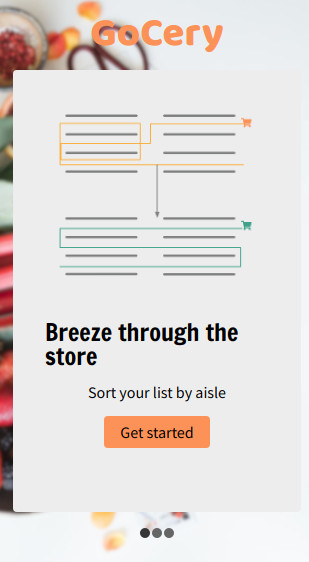
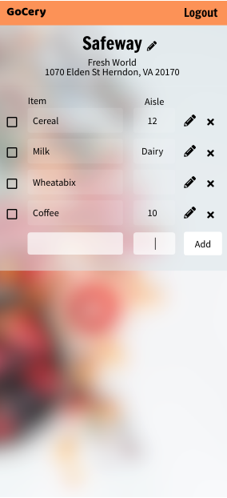
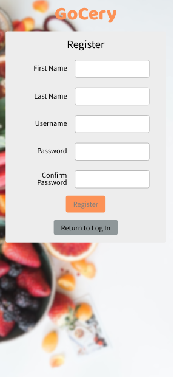
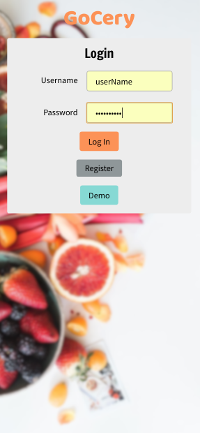
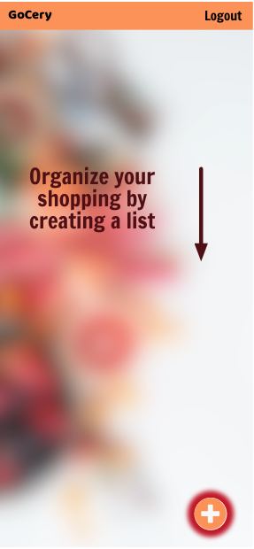
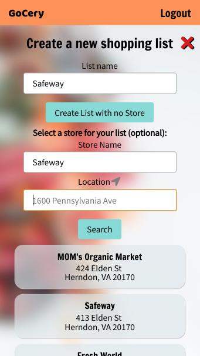
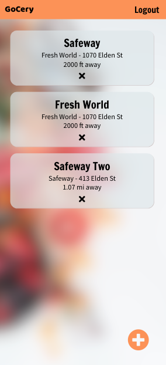

# GoCery

GoCery helps shoppers spend less time in supermarkets by sorting shoppings lists based
on crowd-sourced aisle information.

## Live App

[GoCery](https://gocery-app.netlify.com/)

## Features

- Create shopping lists associated with a particular store
- Add aisle information while you shop
- Sort your shopping list by aisle
- Aisle information from other users fills in the blanks in your list
- Use geolocation to find stores near you

## Tech Stack

- React (Create React App)
- Redux

## Outside API

- Yelp
- Google Maps

## DevTeam

Team [hip-hip]!

- Project Owner: [Arun Seehra](https://github.com/aseehra)
- Project Manager: [Mischa Berlin](https://github.com/mischb)
- QA Lead: [Sam Dalton](https://github.com/SamDaltonJr)
- Design Lead: [Josh Adams](https://github.com/ender554)

## Screenshots

